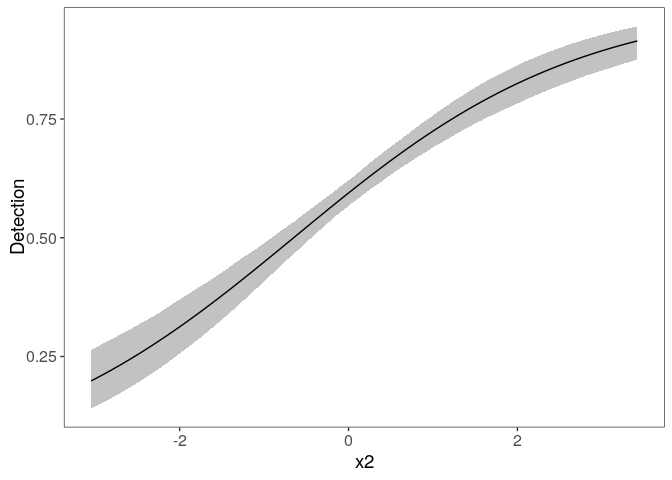

# ubms: Unmarked Bayesian Models with Stan

<!-- badges: start -->

[](https://github.com/kenkellner/ubms/actions)
[](https://codecov.io/gh/kenkellner/ubms?branch=master)
[](https://cran.r-project.org/web/packages/ubms/index.html)
<!-- badges: end -->

`ubms` is an `R` package for fitting Bayesian hierarchical models of
animal occurrence and abundance. The package has a formula-based
interface compatible with
[unmarked](https://cran.r-project.org/web/packages/unmarked/index.html),
but the model is fit using MCMC with [Stan](https://mc-stan.org/)
instead of using maximum likelihood. Currently there are Stan versions
of unmarked functions `occu`, `occuRN`, `colext`, `occuTTD`, `pcount`,
`distsamp`, and `multinomPois`. These functions follow the `stan_`
prefix naming format established by
[rstanarm](https://cran.r-project.org/web/packages/rstanarm/index.html).
For example, the Stan version of the `unmarked` function `occu` is
`stan_occu`.

Advantages compared to `unmarked`:

1.  Obtain posterior distributions of parameters and derived parameters
2.  Include random effects in parameter formulas (same syntax as `lme4`)
3.  Assess model fit using WAIC and LOO via the
    [loo](https://cran.r-project.org/web/packages/loo/index.html)
    package

Disadvantages compared to `unmarked`:

1.  MCMC is slower than maximum likelihood
2.  Not all model types are supported
3.  Potential for convergence issues

## Installation

`ubms` is on
[CRAN](https://cran.r-project.org/web/packages/ubms/index.html):

``` r
install.packages("ubms")
```

Alternatively, the latest development version can be installed from
Github:

``` r
# install.packages("devtools")
devtools::install_github("kenkellner/ubms")
```

If you are on Windows, you can download and install a pre-compiled
binary package of the latest release:

``` r
# Install dependencies
install.packages(c("unmarked", "ggplot2", "gridExtra", "lme4", "loo",
                   "Matrix", "Rcpp", "rstan", "rstantools"))

# Download and install ubms
download.file("https://github.com/kenkellner/ubms/releases/download/v1.0.1/ubms_1.0.1.zip",
              destfile="ubms_1.0.1.zip")
install.packages("ubms_1.0.1.zip", repos=NULL)
```

## Example

Simulate occupancy data including a random effect on occupancy:

``` r
library(ubms)

set.seed(123)
dat_occ <- data.frame(x1=rnorm(500))
dat_p <- data.frame(x2=rnorm(500*5))

y <- matrix(NA, 500, 5)
z <- rep(NA, 500)

b <- c(0.4, -0.5, 0.3, 0.5)

re_fac <- factor(sample(letters[1:26], 500, replace=T))
dat_occ$group <- re_fac
re <- rnorm(26, 0, 1.2)
re_idx <- as.numeric(re_fac)

idx <- 1
for (i in 1:500){
  z[i] <- rbinom(1,1, plogis(b[1] + b[2]*dat_occ$x1[i] + re[re_idx[i]]))
  for (j in 1:5){
    y[i,j] <- z[i]*rbinom(1,1, 
                    plogis(b[3] + b[4]*dat_p$x2[idx]))
    idx <- idx + 1
  }
}
```

Create `unmarked` frame:

``` r
umf <- unmarkedFrameOccu(y=y, siteCovs=dat_occ, obsCovs=dat_p)
```

Fit a model with a random intercept:

``` r
options(mc.cores=3) #number of parallel cores to use
(fm <- stan_occu(~x2 ~x1 + (1|group), umf, chains=3))
```

    ## 
    ## Call:
    ## stan_occu(formula = ~x2 ~ x1 + (1 | group), data = umf, chains = 3, 
    ##     refresh = 0)
    ## 
    ## Occupancy (logit-scale):
    ##                 Estimate    SD   2.5%  97.5% n_eff Rhat
    ## (Intercept)        0.319 0.297 -0.284  0.884   997    1
    ## x1                -0.464 0.120 -0.693 -0.238  4935    1
    ## sigma [1|group]    1.393 0.282  0.951  2.036  2135    1
    ## 
    ## Detection (logit-scale):
    ##             Estimate     SD  2.5% 97.5% n_eff  Rhat
    ## (Intercept)    0.381 0.0572 0.271 0.492  6047 0.999
    ## x2             0.587 0.0616 0.464 0.709  5318 1.000
    ## 
    ## LOOIC: 2267.542

Examine residuals for occupancy and detection submodels (following
[Wright et al. 2019](https://doi.org/10.1002/ecy.2703)). Each panel
represents a draw from the posterior distribution.

``` r
plot(fm)
```

<!-- -->

Assess model goodness-of-fit with a posterior predictive check, using
the MacKenzie-Bailey chi-square test:

``` r
fm_fit <- gof(fm, draws=500)
plot(fm_fit)
```

<!-- -->

Look at the marginal effect of `x2` on detection:

``` r
plot_marginal(fm, "det")
```

<!-- -->

A more detailed vignette for the package is available
[here](https://kenkellner.com/blog/ubms-vignette.html).
